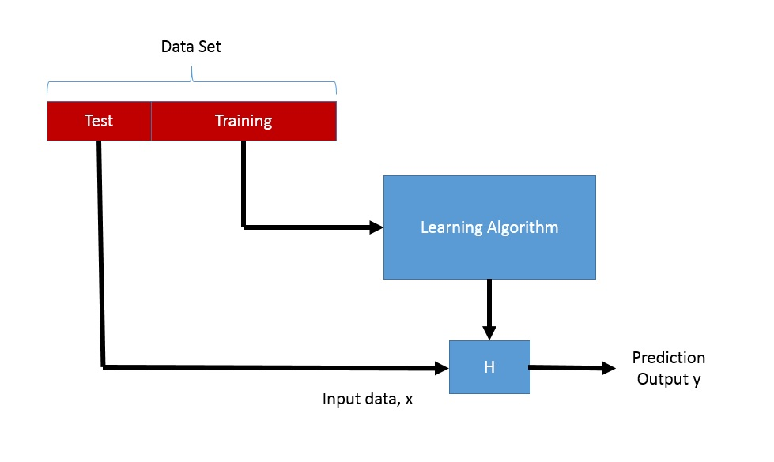

# Learning Process

This lesson aim to setup a basic framework for us to think machine learning process whether it is regression, neural network or even deep learning and etc. Any learning process always start with data and end with data  (predicted data). Thus data play a center role in the learning process, the quality of the data directly affect the result. 

The aim of any learning process is to build a model using data on hand and subsequently use it in prediction, classification or etc.

