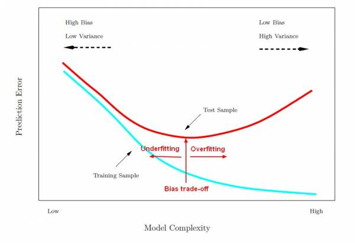

# Learning Process

This lesson aim to setup a basic framework for us to think machine learning process whether it is regression, neural network or even deep learning and etc. Any learning process always start with data and end with data  (predicted data). Thus data play a center role in the learning process, the quality of the data directly affect the result. 

The aim of any learning process is to build a model using data on hand and subsequently use it in prediction, classification or etc.

Figure 1 The learning process

The data set need to be split into two set:training and test. The ratio usually is 7:3 to have enough data for training and yet sufficient data for test the ability of the model to generalize. It is important to note that:

- The model that is train cannot "see" the test data set training the training phase
- Test data is to test the ability of the model to adapt to data that it had not seen before. This is prevent over fitting
- If we actually training a few models and select the one with best performance with test data, the test data would be considered to be part of the training set. Thus, we need to reserve third set of data usually known as validation set to test the ability of the model to generalize
- It is usually better to select the data for each set randomly. However, in order ensure that the test can be replicated, we got to seed the random number generator.

Figure 2 model complexity vs error 

(Source for graph https://gerardnico.com/wiki/data_mining/bias_trade-off)

